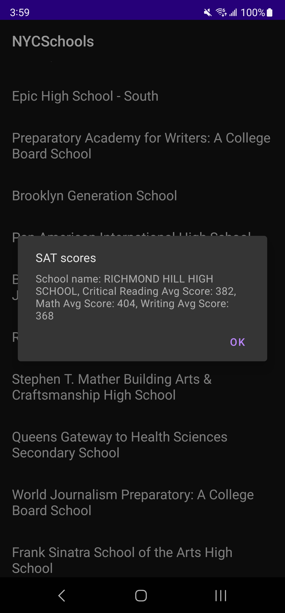

### This is a practice project

#### Function

- Display a list of NYC schools on start
- Clicking on a school will try to query and display its SAT scores

#### Libraries used

- Retrofit
- Gson
- Jetpack Lifecycle
- Recycler view
- Android material dialog

#### Architecture

- MVVM

#### Thoughts on improvements if given more time

- Use DI tools instead of going hard for singleton.
- Use local persistence tool like Room to save result.
- Use Rxjava to replace callback.
- Would be nice if can migrate to Kotlin world.

